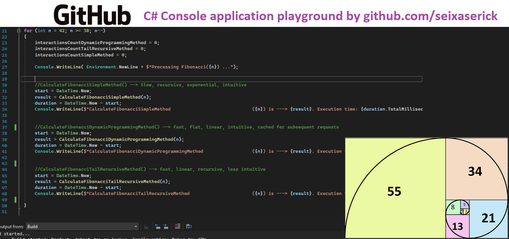

# C# Console application playground (algorithms, .NET new feature tests, performance comparison)

 
# Context

This is a collection of unstructured tests. Please to not expect a good documentation neither any code logic.

Just tests!!!!

# About the Author and license
- **Erick** is a Senior Backend Developer and Architect. 
- You can reach **Erick** by email <seixaserick77@gmail.com> or Linkedin <https://www.linkedin.com/in/seixaserick/>
- Other Github Repositories: <https://github.com/seixaserick/> 
- MIT License (please check [LICENSE.txt](LICENSE.txt) for more details)

